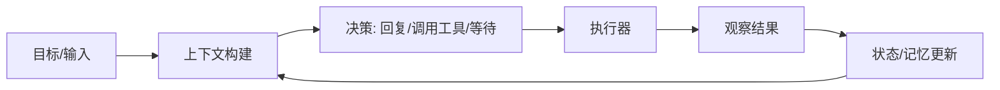

# Agent 智能体：把“大模型会说”变成“系统能做”

Agent（智能体）不是某个特定模型或框架，而是一类系统形态：它以目标为中心，能在多轮过程中组织信息、做出决策、调用工具执行动作，并根据结果继续推进任务。你可以把 LLM 看作“脑”，而 Agent 是“脑 + 手脚 + 运行机制”的组合。

## 1. 什么是 Agent

从工程角度，一个系统要称得上 Agent，通常具备三个要素：

- **目标导向**：输入不是单纯聊天话题，而是要完成的任务与约束（时限、权限、成本、格式）。
- **可执行**：能把决策落到行动上（调用工具/API、读写数据、触发流程），而不仅是生成文本。
- **可持续**：能跨多轮维护状态（进度、已知事实、失败原因），根据观察结果调整下一步。

## 2. 为什么 LLM 时代 Agent 再次成为主角

传统软件 Agent 依赖规则、规划算法或强化学习，在开放域的语言理解与泛化能力上成本很高。LLM 出现后，Agent 形态的门槛被明显降低：

- **语言理解与推理能力**让“用自然语言描述任务”变得可行
- **结构化输出/函数调用能力**让“把意图对接到工具”更稳定
- **文本生成能力**让“过程解释、总结汇报、对话交互”天然具备

但要强调的是：LLM 解决的是“认知与表达”，Agent 还需要“执行与控制面”。否则系统仍然停留在“会回答但不会办事”。

## 3. Agent 的典型工作方式：一个闭环

Agent 的核心不是某个模块名字，而是闭环运行：每一轮都在决定“下一步做什么”，并用结果更新状态。



这个循环解释了为什么 Agent 必须具备工具、状态与执行器：缺任一环，就很难稳定完成多步骤任务。

## 4. Agent 与 LLM（或聊天机器人）的区别

很多“看起来像 Agent”的产品，实际上只是一个带对话历史的聊天机器人。可以用四个维度做区分：

### 4.1 输入形态

- **LLM/聊天机器人**：以问答为主，输入多是“请解释/请写一段”
- **Agent**：以任务为主，输入通常包含目标、约束、资源与验收标准

### 4.2 行为能力

- **LLM/聊天机器人**：主要输出文本
- **Agent**：能选择动作并执行（工具调用、检索、改文件、发请求、触发流程）

### 4.3 运行方式

- **LLM/聊天机器人**：被动响应，每轮相对独立
- **Agent**：持续推进，多轮自我纠错，必要时拆分子任务

### 4.4 可控性与可观测性

- **LLM/聊天机器人**：难追踪“为什么这么答”
- **Agent**：应当可回放每轮输入、工具调用、结果与状态变化，便于评估与治理

用一句话概括：

```text
Agent = LLM + 工具（行动）+ 状态（持续）+ 策略（决策）+ 执行（控制）
```

## 5. 常见的 Agent 形态（从简单到复杂）

### 5.1 工具增强问答（最轻量）

主要是“先检索/查询，再回答”，通常不需要长流程，但需要工具与上下文构建。适合知识问答、客服检索、内部文档助手。

### 5.2 迭代执行型（多步任务）

每轮决定下一步行动，直到完成目标或遇到不可恢复失败。适合数据分析、自动化办公、排障等。

### 5.3 工作流/图编排型（强约束）

用固定节点和分支把流程固化，LLM 只在少数节点做决策或填参。适合合规要求高、流程确定、可审计场景。

### 5.4 多智能体协作（分工与对抗）

把复杂任务拆给多个角色（规划者、执行者、审核者、检索者等），通过消息协作完成。适合大型项目、长链路任务，但复杂度与成本也更高。

## 6. 什么时候应该用 Agent

一个实用判断：如果你的问题满足以下任意两条，通常就值得用 Agent 思路来做系统化设计：

- 任务需要**多步骤**推进，且每一步依赖上一步的结果
- 需要**外部动作**（工具/API/系统操作），而不是只生成一段文字
- 需要**可恢复与可追踪**（中断续跑、失败重试、过程审计）
- 需要**可靠性与治理**（权限、确认、风控、评估）

如果只是单轮写作、翻译、润色，LLM 即可；过早引入 Agent 反而会带来成本与不确定性。

## 7. 小结与下一篇

Agent 是“面向任务的闭环系统”，LLM 只是其中的大脑。真正决定能不能落地的，往往是工具契约、状态管理、执行控制与可观测性。

下一篇会把“核心组件”按工程视角逐一展开：[02.agent的核心组件](./02.agent的核心组件.md)。
