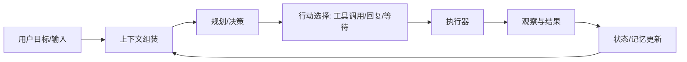

# Agent 的核心组件：从“能聊”到“能做”的最小闭环

开发一个智能体（Agent），本质上是在构建一个“感知 → 思考 → 行动 → 反馈”的闭环系统：它能接收目标与上下文，基于工具与知识做出决策，执行动作并从结果中继续迭代。相比“只会对话”的聊天机器人，Agent 的关键差异在于：它具备可控的执行能力、可持续的状态管理、以及面向任务的运行循环。

本文从工程视角拆解一个可落地的 Agent 需要哪些核心组件，以及每个组件在系统中的作用。你可以把它当作实现时的“组件清单 + 设计指南”。

## 1. 最小可用架构：Agent Loop

一个可用的 Agent 至少需要形成闭环：输入目标与上下文，产生下一步行动，执行并观察结果，再决定下一步。

下面的“核心组件”基本都围绕这个循环展开。

## 2. 模型（LLM/多模型）：智能体的“推理与生成引擎”

**作用**
- 将目标与上下文转化为“下一步做什么”的决策（计划、工具调用参数、澄清问题、最终回答）。
- 生成自然语言输出（对用户解释、总结、报告）。
- 在多步任务中做分解、取舍、权衡（在可控约束下）。

**工程要点**
- 不一定只用一个模型：常见做法是“主模型负责决策 + 小模型负责分类/路由/提取/审核”。
- 模型能力决定上限，但系统设计决定下限：没有工具、记忆与控制面，强模型也很难稳定完成复杂任务。

## 3. 指令与提示词（System Prompt / Policy / 角色设定）：智能体的“操作手册”

**作用**
- 定义智能体的边界：能做什么、不能做什么、遇到不确定如何处理。
- 约束输出格式：例如结构化 JSON、函数调用、固定模板报告。
- 统一风格与策略：例如优先使用工具、先确认关键前提、必要时拒绝。

**工程要点**
- 把“长期稳定的规则”与“本次任务的短期信息”分离：前者放系统指令，后者放会话上下文。
- 指令是可迭代资产：用真实失败案例驱动提示词更新，比凭空写一份长 prompt 更有效。

## 4. 工具系统（Tools / Function Calling）：智能体的“行动能力”

Agent 真正的“能做事”，来自工具调用。工具可以是 API、数据库查询、代码执行、浏览器操作、文件读写、企业内部系统等。

**作用**
- 让模型把意图变成可执行动作（如检索、计算、下单、发消息、改文件）。
- 将不可靠的“口头推理”外包给确定性系统（例如算术、查询、编译、测试）。

**工程要点**
- 工具要有清晰输入输出契约：参数 schema、错误码、幂等性、超时策略。
- 做好权限与隔离：不同工具需要不同权限；尽量最小权限原则。
- 结果可回放：记录每次工具调用的参数与返回，用于调试与评估。

## 5. 记忆与状态（Memory/State）：智能体的“长期与短期脑袋”

如果没有状态管理，Agent 只能“单轮聪明”。一个成熟系统需要管理至少三类记忆：

**（1）短期记忆：会话上下文**
- 作用：维持对话连贯性，保留本次任务的重要约束（目标、偏好、当前进度）。
- 常见实现：对话历史 + 关键事实摘要（避免上下文无限增长）。

**（2）长期记忆：用户与任务画像**
- 作用：跨会话记住偏好与稳定信息（语言、格式偏好、常用系统、业务规则）。
- 常见实现：结构化存储（用户 profile）、向量库记忆（语义检索）。

**（3）工作记忆：任务执行状态**
- 作用：记录当前 plan、已完成步骤、待办、工具调用结果、失败原因与重试次数。
- 常见实现：一个可序列化的状态对象（state machine / task graph）。

**工程要点**
- “记住什么”比“能记住”更重要：只存能提升后续决策质量的信息。
- 记忆要可控可删：支持用户要求删除/不保存某类信息，满足合规。

## 6. 规划与决策（Planner/Policy）：智能体的“任务分解与策略选择”

规划不是必须先写成一段长计划；更常见的是“局部规划”：每轮决定下一步最合适的动作。

**作用**
- 把目标分解为步骤（ToDo、子任务、依赖关系）。
- 选择策略：先检索再回答、先验证再执行、遇到错误先回滚还是换方案。
- 控制成本与风险：限制工具调用次数、限制外部写操作、选择低风险路径。

**常见形态**
- ReAct 风格：每轮“思考 → 行动 → 观察”。
- Plan-and-Execute：先出全局计划，再逐步执行与修正。
- Graph/Workflow：将任务编排为有向图，节点是工具或子 Agent。

## 7. 上下文构建（Context Builder）：智能体的“信息装配线”

模型质量与上下文强相关。上下文构建负责把“该给模型看的信息”在每一轮装配成输入。

**作用**
- 选择并压缩对话历史（例如摘要、提取约束、删除噪声）。
- 注入外部知识（RAG 检索结果、数据库查询结果、规范文档片段）。
- 注入运行时状态（当前任务进度、可用工具列表与说明、权限信息）。

**工程要点**
- 目标不是“给得越多越好”，而是“给得恰到好处”：无关信息会显著拉低决策质量。
- 对检索内容做去重、分段、引用标注，避免模型被长文本淹没。

## 8. 知识检索（RAG）：智能体的“外部记忆与事实来源”

很多任务失败不是“不会推理”，而是“缺事实”。RAG 让 Agent 面向你的私有知识库、产品文档、代码仓库等获取事实依据。

**作用**
- 提供可追溯的事实与依据，降低幻觉。
- 支持企业私有知识：制度、流程、接口文档、故障手册。

**工程要点**
- 索引质量决定上限：良好的切分、元数据（来源、时间、权限）、定期更新比换向量模型更关键。
- 输出要带引用：便于审计与纠错，也方便用户信任与复核。

## 9. 执行器与运行时（Executor/Runtime）：智能体的“可靠执行层”

执行器负责把“模型说要做的事情”落地执行，并且提供稳定的错误处理。

**作用**
- 调用工具、处理超时与重试、做并发控制与速率限制。
- 将工具返回规范化成可供下一轮使用的观察（Observation）。
- 隔离风险动作（例如写库、发消息、改代码需要额外审批或沙箱）。

**工程要点**
- 明确失败语义：可重试/不可重试、部分成功、需要人工介入。
- 保持可恢复：执行中断后能从 state 恢复，不至于“失忆”。

## 10. 监控、评估与回放（Observability/Eval）：智能体的“质量闭环”

Agent 系统必须可观测，否则你无法知道它为什么失败、失败在哪里、如何改进。

**作用**
- 记录每轮输入、检索片段、工具调用、输出与耗时成本。
- 支持回放与复现：同一输入在不同版本 prompt/模型/策略下对比效果。
- 支持离线评估：任务成功率、工具调用准确率、幻觉率、成本与延迟。

**工程要点**
- 把“评估指标”当作产品需求：例如“成功完成订单变更”比“回答更像人”更可度量。
- 做分层评估：单步工具调用正确性、检索命中率、端到端任务成功率。

## 11. 安全与对齐（Safety/Guardrails）：智能体的“防护网”

Agent 一旦能调用工具，就可能产生真实影响，因此安全组件是核心而非附加项。

**作用**
- 权限控制：哪些用户能做哪些动作、哪些工具可用。
- 内容安全：拒绝违规请求、脱敏、避免泄露敏感信息。
- 行为安全：高风险动作需要确认、审批、或只读模式运行。

**常见机制**
- 策略引擎：基于用户、环境、动作类型做准入判断。
- 输出审查：在关键场景使用二次模型/规则做校验。
- 沙箱与审计：代码执行/文件操作隔离，并完整记录。

## 12. 人在回路（HITL）：智能体的“兜底与增强”

在高风险或高价值场景，完全自动化往往不是最优解。

**作用**
- 需要人工确认的点：付款、发版、群发通知、删除数据等。
- 需要人工补充的信息：缺少关键参数、流程分歧、异常处理。
- 将人类反馈转化为可学习资产：用于改进策略、提示词与工具接口。

## 13. 组件清单：从 0 到 1 的落地顺序

如果你要从零实现一个可用 Agent，推荐按“先闭环、再增强”的顺序：

1. **Agent Loop + 基础模型调用**：先能多轮推进任务。
2. **工具系统 + 执行器**：让它能做 1–2 类确定性动作（查询/计算/写文件等）。
3. **状态管理**：让任务可恢复、可追踪、有进度。
4. **上下文构建 + RAG**：在你最常用的知识域里稳定输出。
5. **观测与评估**：能定位失败原因，迭代有抓手。
6. **安全与 HITL**：把风险动作纳入流程控制。

## 14. 一个实用判断：你的系统是不是 Agent？

满足以下三点，基本就可以称为工程意义上的 Agent：
- 能把用户目标转成可执行动作（工具调用/工作流节点）；
- 有状态，能跨多轮推进并从结果中调整；
- 有控制面：失败可恢复、行为可限制、过程可观测。

---

到这里你已经拥有了构建 Agent 的“核心组件地图”。下一篇通常会自然延伸到：Agent 的运行循环如何设计、工具契约怎么定义、RAG 的工程化细节，以及如何做评估与安全上线。你也可以把你的具体场景（比如写代码、客服、运维、数据分析、流程审批）发我，我可以按你的场景把这套组件落成一套具体架构与模块划分。
