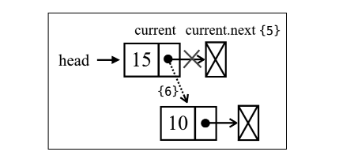

# 链表

要存储多个元素，数组可能是最常用的数据结构。几乎每种语言都实现了数组。这种数据结构非常方便，提供了一个便利的`[]`语法来访问其元素。然而，这种数据结构有一个缺点：**在大多数语言中**数组的大小是固定的，从数组的起点或中间插入或移除项的成本很高，因为需要移动元素。（尽管我们已经学过，JavaScript 有来自 Array 类的方法可以帮我们做这些事，但背后的情况同样如此。）

链表存储有序的元素集合，但不同于数组，链表中的元素在内存中并不是连续放置的。每个元素由一个存储元素本身的节点和一个指向下一个元素的引用（也称指针或链接）组成。下图展示了一个链表的结构。


相对于传统的数组，链表的一个好处在于，添加或移除元素的时候不需要移动其他元素。然而，链表需要使用指针，因此实现链表时需要额外注意。在数组中，我们可以直接访问任何位置的任何元素，**而要想访问链表中间的一个元素，则需要从起点（表头）开始迭代链表直到找到所需的元素。**

生活中用来说明链表的最流行的例子，那就是火车。一列火车是由一系列车厢（也称车皮）组成的。每节车厢或车皮都相互连接。你很容易分离一节车皮，改变它的位置、添加或移除它。下图演示了一列火车。每节车皮都是链表的元素，车皮间的连接就是指针。


## 创建链表

我们首先搭建骨架
```js
function defaultEquals(a,b) {
  return a === b
}

// 这是个助手类
class Node {
  constructor(element) {
    this.element = element;
    this.next = undefined;
  }
}

// 链表类
class LinkedList {
  constructor(equalsFn = defaultEquals) {
    this.count = 0; // 用来存储链表中的元素数量
    this.head = undefined; // 数据结构是动态的，我们需要将第一个元素的引用保存下来
    this.equalsFn = equalsFn; // 比较函数 如果用户不自己定义，就使用我们默认给出的比较方法
  }
}
```

## 开始逐一实现下述方法
- push(element): 向链表尾部添加一个新的元素
- insert(element, position): 向链表的特定位置插入一个元素
- getElementAt(index): 返回链表中特定位置的元素，如果链表中不存在这样的元素，则返回undefined。
- remove(element): 从链表中删除一个元素
- indexOf(element): 返回元素在链表中的索引，如果链表中没有这个元素则返回-1；
- removeAt(position): 从链表的特定位置移除一个元素
- isEmpty(): 如果链表中不包含任何元素，返回true，如果链表长度大于0，则返回false。
- size(): 返回的链表中包含的元素的个数，与数组的length属性类似。
- toString(): 返回表示整个链表的字符串，由于列表使用了Node类，就需要重写继承自JavaScript对象默认的toString方法。

## 向链表尾部添加元素
向 LinkedList 对象尾部添加一个元素的时候，可能有两种场景：
- 1、链表为空，添加的是第一个元素；
- 2、链表不为空，向其追加元素。

```js
push(element) {
  const node = new Node(element) // 首先需要做的是把 element 作为值传入，创建 Node 项
  let current;
  /**
   * 先来实现第一个场景：向空列表添加一个元素。
   * 当我们创建一个 LinkedList 对象时，head 
   * 会指向 undefined（或者是 null）。
  */ 
  if(this.head == null) {
    this.head = node
  } else {
    /**
     * 要向链表的尾部添加一个元素，首先需要找到最后一个元素。
     * 记住，我们只有第一个元素的引用, 因此需要循环访问列表，
     * 直到找到最后一项。为此，我们需要一个指向链表中current 项的变量
     * 在循环访问链表的过程中，当 current.next 元素为 undefined 或 null 时，
     * 我们就知道已经到达链表尾部了
     * 然后要做的就是让当前（也就是最后一个）元素的 next 指针指向想要添加到链表的节点
     */
    current = this.head;
    while(current.next != null) {
      current = current.head;
    }
    // 退出循环时候 current.next 是null或者undefined，将其next赋值为新元素 建立链接
    current.next = node;
  }
  this.count++
}
```
空链表插入元素图示


非空链表插入元素图示



我们可以通过以下代码来使用和测试目前创建的数据结构。

```js
const list = new LinkedList(); 
list.push(15); 
list.push(10);
```


