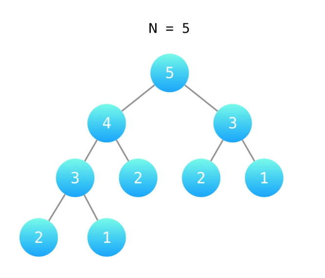

# 70.Climbing Stairs
## [题目描述](https://leetcode-cn.com/problems/climbing-stairs/)

::: tip
tags：记忆化搜索、数学、动态规划

关联企业：百度、贝壳找房、腾讯
:::

## 算法思路
1、爬楼梯问题 可以先通过找规律的方法来进行梳理：

- 有1级台阶，1、有一种方法，也就是爬一级。总共1种方法。
- 有2级台阶，1、第一次爬1级，第二次爬1级;  2、或者一次爬2级，总共2种方法。
- 有3级台阶，1、一级一级的爬；2、先爬一级，再爬两级；3、先爬两级，再爬一级  总共3中方法。
- 有4级台阶，1、一级一级的爬；2、先爬一级，再爬一级，最后爬两级；3、先爬两级，再爬一级，最后爬一级；4、先爬一级，再爬两级，最后爬一级，5、先爬两级，再爬两级

通过上述这种找规律，我们可以看到，爬到n阶，要么从`n-1`阶爬一级，要么从`n-2`阶爬两级，从上面的4级台阶的例子，我们可以从3级台阶向上爬一级，也可以从2级台阶向上爬2级。

我们用`f(x)`表示爬到第x级台阶的方案数，考虑最后一步可能跨了一级台阶，也可能跨了两级台阶，换句话说，两种方案可选。所以我们可以列出如下式子：

可以得出**递推公式**：`f(x) = f(x-1) + f(x-2)`。

它意味着爬到第 x 级台阶的方案数是爬到第 `x - 1` 级台阶的方案数和爬到第 `x - 2` 级台阶的方案数的和。很好理解，因为每次只能爬 1 级或 2 级，所以 `f(x)` 只能从 `f(x - 1)` 和 `f(x - 2)` 转移过来，而这里要统计方案总数，我们就需要对这两项的贡献求和。

```js
/**
 * @param {number} n
 * @return {number}
 */
// 这题是动态规划问题，动态规划问题的核心是自底想上的解决问题
var climbStairs = function (n) {
  if (n ===1) {
    return 1
  }
  if (n === 2) {
    return 2
  }
  return climbStairs(n-1) + climbStairs(n-2)
};
```

我们可以用一颗树来表示上面代码的执行过程：



从树中的构造中可以看到，有很多重复的部分，这些重复的部分是可以进行优化的，具体的思路是，我们可以准备一个**记忆数组**，将计算过的节点，存入数组中，下次再用到这个节点数据的时候直接从数组中取出来就好，不需要重复计算了。

```ts
function climbStairs(n: number): number {
  // 准备一个记忆化数组
  let memo: number[] = [];
  
  // memo[0] 代表 数组第 0 位 一级台阶也没有的情况
  memo[0] = 1
  
  // memo[1] 代表 只有 一级 台阶的情况
  memo[1] = 1

  for (let i = 2; i <= n; i++) {
    memo[i] = memo[i-1] + memo[i-2]
  }
  return memo[n]
};
```

```go
func climbStairs(n int) int {
    // 准备一个记忆化数组
    memo := make([]int, n+1)
    
    // 处理特殊情况
    if n <= 1 {
        return 1
    }
    
    // 初始化基础值
    memo[0] = 1
    memo[1] = 1
    
    // 使用循环填充记忆化数组
    for i := 2; i <= n; i++ {
        memo[i] = memo[i-1] + memo[i-2]
    }
    
    return memo[n]
}
```