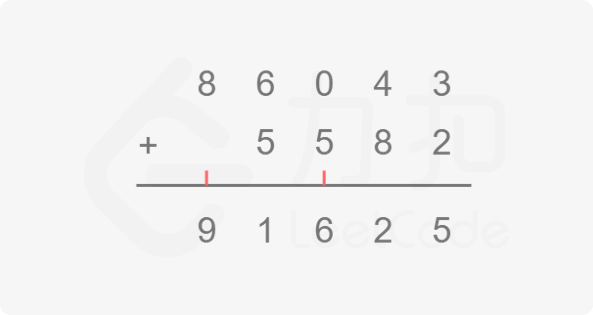

# NC1.大数加法

## 描述
以字符串的形式读入两个数字，编写一个函数计算它们的和，以字符串形式返回。

数据范围：s.length, t.length ≤ 100000，字符串仅由'0'~'9'构成

要求：时间复杂度 O(n)

## 示例1
```
输入："1","99"
返回值："100"
说明：1+99=100   

输入："114514",""
返回值："114514"
```

## 模拟
本题只需要对两个整数模拟「竖式加法」的过程，竖式加法就是我们平常学习生活中常用的对两个整数相加的方法，回想一下我们在纸上对两个整数相加的操作，就是将相同的数位置对齐，从低到高逐位相加，如果当前位置的和超过**10**，则向高位进一位，因此我们只要将这个过程使用代码写出来即可。



具体实现也不复杂，我们定义两个指针 i 和 j 分别指向 num1、num2 的末尾，即最低位，同时定义一个变量 add 维护当前是否有进位，然后从末尾到开头逐位相加即可。你可能会想两个数字位数不同怎么处理，这里我们统一在指针当前下标处于负数的时候返回 0，等价于对位数较短的数字进行了补零操作，这样就可以除去两个数字位数不同情况的处理，具体可以看下面的代码。

```js
/**
 * @param {string} num1
 * @param {string} num2
 * @return {string}
 */
var addStrings = function(num1, num2) {
  let i = num1.length - 1, j = num2.length - 1, add = 0;
  const ans = [];
  while (i >= 0 || j >= 0 || add != 0) {
    const x = i >= 0 ? num1.charAt(i) - '0' : 0;
    const y = j >= 0 ? num2.charAt(j) - '0' : 0;
    const result = x + y + add;
    ans.push(result % 10);
    add = Math.floor(result / 10);
    i -= 1;
    j -= 1;
  }
  return ans.reverse().join('');
};
```

## 复杂度分析

- 时间复杂度：O(max(len1,len2))，其中len1=num1.length，len2=num2.length竖式加法的次数取决于较大数的位数。
- 空间复杂度：O(1)


