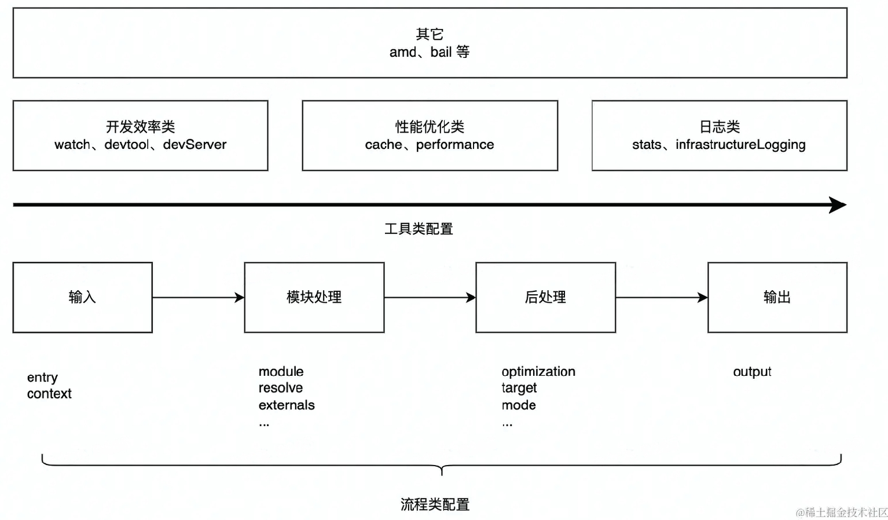

# 深入理解Webpack配置的底层逻辑

Webpack5提供了非常强大、灵活的模块打包功能，配合其成熟生态下数量庞大的插件、Loader资源，已经能够满足大多数前端项目的工程化需求，但代价则是日益复杂、晦涩的使用方法，开发者通常需要根据项目环境、资源类型、编译目标编写一份复杂的配置文件，用以定制资源打包行为。

问题是，仅 Webpack 原生配置项就多达上百种，且各项之间缺乏一致性与关联度，对初学者而言单是掌握每一个配置的作用与变种就已经很难，更不用说理解配置与配置之间的协作关系。

对此，这里将尝试通过一种结构化视角分类讨论 Webpack 各个核心配置项的功能与作用；再用一个简单的例子介绍配置项结构的逻辑；最后介绍一些业界比较知名，能迅速生成项目脚手架的工具。

## 结构化理解 Webpack 配置项

Webpack 原生提供了上百种配置项，这些配置最终都会作用于 Webpack 打包过程的不同阶段，因此我们可以从流程角度更框架性、结构化地了解各项配置的作用。

Webpack 的打包过程非常复杂，但大致上可简化为：

> 输入 -> 模块处理 -> 后处理 -> 输出

- **输入**：从文件系统读入代码文件；
- **模块递归处理**：调用 Loader 转译 Module 内容，并将结果转换为AST，从中分析出模块依赖关系，进一步递归调用模块处理过程，直到所有依赖文件都处理完毕；
- **后处理**：所有模块递归处理完毕后开始执行后处理，包括模块合并、注入运行时、产物优化等，最终输出 Chunk 集合；
- **输出**：将 Chunk 写出到外部文件系统；

从上述打包流程角度，Webpack 配置项大体上可分为两类：

- **流程类**：作用于打包流程某个或若干个环节，直接影响编译打包效果的配置项
- **工具类**：打包主流程之外，提供更多工程化工具的配置项

### 流程类的配置概述：
与打包流程强相关的配置项有：

- 输入输出：
  - `entry`: 用于定义项目入口文件，Webpack 会从这些入口文件开始按图索骥找出所有项目文件；
  - `context`: 项目执行上下文路径；
  - `output`: 配置产物的输出路径、名称等；
- 模块处理：
  - `resolve`: 用于配置模块路径解析规则，可用于帮助 Webpack 更精确、高效地找到指定模块
  - `module`: 用于配置模块加载规则，例如针对什么类型的资源需要使用哪些 Loader 进行处理
  - `externals`: 用于声明外部资源，Webpack 会直接忽略这部分资源，跳过这些资源的解析、打包操作
- 后处理：
  - `optimization`: 用于控制如何优化产物包体积，内置 Dead Code Elimination、Scope Hoisting、代码混淆、代码压缩等功能;
  - `target`: 用于配置编译产物的目标运行环境，支持 web、node、electron 等值，不同值最终产物会有所差异;
  - `mode`: 编译模式短语，支持 development、production 等值，可以理解为一种声明环境的短语

这里的重点是，Webpack 首先需要根据输入配置(`entry/context`) 找到项目入口文件；之后根据按模块处理(`module/resolve/externals`等) 所配置的规则逐一处理模块文件，处理过程包括转译、依赖分析等；模块处理完毕后，最后再根据后处理相关配置项(`optimization/target` 等)合并模块资源、注入运行时依赖、优化产物结构等。

这些配置项与打包流程强相关，使用的时候需要多关注它们对主流程的影响，例如`entry`决定了项目入口，而`output`则决定产物最终往哪里输出；`resolve`决定了怎么找到模块，而`module` 决定了如何解读模块内容，等等。。。。。。

### 工具配置项综述：

除了核心的打包功能之外，Webpack 还提供了一系列用于提升研发效率的工具，大体上可划分为：
- 开发效率类：
  - `watch`：用于配置持续监听文件变化，持续构建
  - `devtool`：用于配置产物 Sourcemap 生成规则
  - `devServer`：用于配置与 HMR 强相关的开发服务器功能
- 性能优化类：
  - `cache`：Webpack5之后，该项用于控制如何缓存编译过程信息与编译结果
  - `performance`：用于配置当产物大小超过阈值时，如何通知开发者
- 日志类：
  - `stats`：用于精确地控制编译过程的日志内容，在做比较细致的性能调试时非常有用
  - `infrastructureLogging`：用于控制日志输出方式，例如可以通过该配置将日志输出到磁盘文件

逻辑上，每一个工具类配置都在主流程之外提供额外的工程化能力，例如`devtool`用于配置产物 Sourcemap 生成规则，与 Sourcemap 强相关；`devServer` 用于配置与 HMR 相关的开发服务器功能；`watch` 用于实现持续监听、构建。

工具类配置内聚性较强，通常一个配置项专注于解决一类工程问题，学习时建议先对配置项按其功能做个简单分类，例如上述开发效率类、性能优化类等，之后再展开研究其可选值与效果。

