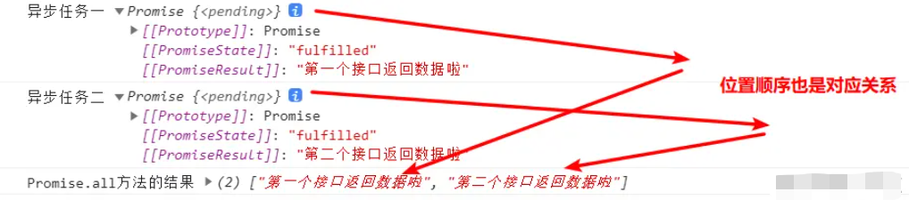

# Promise.all 基本使用和原理实现：

## 基本定义和概念
- Promise.all 的返回值是一个新的 Promise 实例。
- Promise.all 接收一个可遍历的数据容器（这里就认为是数组），容器中的每个元素都是Promise实例。
- 数组中每个Promise实例都成功时（由pendding状态转化为fulfilled状态），Promise.all 才成功。这些 Promise 实例所有的 resolve 结果会按照原来的顺序集合在一个数组中作为 Promise.all 的 resolve 的结果。
- 数组中只要有一个 Promise 实例失败（由pendding状态转化为rejected状态），Promise.all 就失败。Promise.all 的 .catch() 会捕获到这个reject。

简而言之：Promise.all().then()适用于处理多个异步任务，且所有的异步任务都得到结果时的情况。

## 应用场景
比如：用户点击按钮，会弹出一个浮层对话框，对话框中有**两部分数据**需要呈现，这两部分数据分别是不同的后端接口获取的数据。

弹框弹出后的初始情况下，就让这个弹出框处于`数据加载中`的状态，当这两部分数据都从接口获取到的时候，才让这个`数据加载中`状态消失。让用户看到这两部分的数据。

那么此时，我们就需求这两个异步接口请求任务都完成的时候做处理，所以此时，使用Promise.all方法，就可以轻松的实现，我们来看一下代码写法, 以vue的使用场景举例。 

```vue
<template>
  <div class="box">
    <el-button type="primary" plain @click="clickFn">点开弹出框</el-button>
  </div>
</template>

<script>
export default {
  name: "App",
  methods: {
    clickFn() {
      this.alertMask = true; // 打开弹出框
      this.loading = true; // 暂时还没数据，所以就呈现loading加载中效果

      // 第一个异步任务
      function asyncOne() {
        let async1 = new Promise(async (resolve, reject) => {
          setTimeout(() => {
            // 这里我们用定时器模拟后端发请求的返回的结果，毕竟都是异步的
            let apiData1 = "第一个接口返回数据啦";
            resolve(apiData1);
          }, 800);
        });
        return async1;
      }
      console.log("异步任务一", asyncOne());  // 返回的是一个Promise对象

      // 第二个异步任务
      function asyncTwo() {
        let async2 = new Promise(async (resolve, reject) => {
          setTimeout(() => {
            let apiData2 = "第二个接口返回数据啦";
            resolve(apiData2);
          }, 700);
        });
        return async2;
      }
      console.log("异步任务二", asyncTwo()); // 返回的是一个Promise对象

      let paramsArr = [asyncOne(), asyncTwo()]

      // Promise.all方法接收的参数是一个数组，数组中的每一项是一个个的Promise对象
      // 我们在 .then方法里面可以取到 .all的结果。这个结果是一个数组，数组中的每一项
      // 对应的就是 .all数组中的每一项的请求结果返回的值
      Promise
      .all(paramsArr)
      .then((value) => {
        console.log("Promise.all方法的结果", value);
        this.loading = true; // 现在有数据了，所以就关闭loading加载中效果
      });
    },
  },
};
</script>
```

Promise.all方法接收的参数是一个数组，数组中的每一项是一个个的Promise对象，我们在 `.then` 方法里面可以取到 `.all` 的结果。这个结果是一个数组，数组中的每一项对应的就是`.all`数组中的每一项的请求结果返回的值。

查看下控制台的打印输出:




## promsie.all 模拟实现
- 1、接收的参数是一个数组。数组里面不一定非得是promise, 比如一个常数也是可以的。
- 2、多个promise都拿到结果之后，统一返回，其中有一个失败了，就认为此次的处理失败了。
- 3、返回的结果也是按照入参的顺序返回的。
- 4、此方法可以使用 then 方法，返回值也是一个Promsie

```js
Promise.all([1,2,3,
  new Promise((resolve,reject)=>{resolve("成功1")}),  
  new Promise((resolve,reject)=>{resolve("成功2")}),  
]).then((data) => {
  console.log(data)
}).catch((error) => { 
  console.log(error)
})
// 打印结果: [1, 2, 3, '成功1', '成功2']

Promise.all([1,2,3,
  new Promise((resolve,reject)=>{resolve("成功1")}),  
  new Promise((resolve,reject)=>{reject("失败了")}),  
]).then((data) => {
  console.log(data)
}).catch((error) => { 
  console.log(error+"走到了catch") 
})
// 打印结果：失败了走到了catch
```
我们尝试自己手写一版：

```js
Promise.all = function(promises) {
  // 返回的是一个promsie
  return new Promise((resolve, reject) => {
    let result = []; // 顺序存储结果

    // 一个计数器
    let times = 0

    // 需要封装一个方法处理成功的逻辑
    const processSuccess = (index,value) => {
      // 创建映射关系，存放进数组中
      result[index] = value
      if (++times === promises.length) {
        resolve(result)
      }
    }

    // 并发执行异步任务
    for (let i = 0; i < promises.lenght; i++) {
      // 拿到每一个执行
      let p = promises[i]
      // 因为传递的参数不一定是哦promsie，所以需要进行类型判断
      // p存在，并且有then方法
      if (p && typeof p.then === "function") {
        // 执行这个promise 拿到它的执行结果 then 是个异步方法
        // 走入then 方法的时候 for循环已经执行完毕了
        p.then((data) => {
          processSuccess(i, data)
        },reject); // 其中任何一个promise失败了直接执行reject即可
      } else {
        processSuccess(i, p)
      }
    }
  })
}
```
