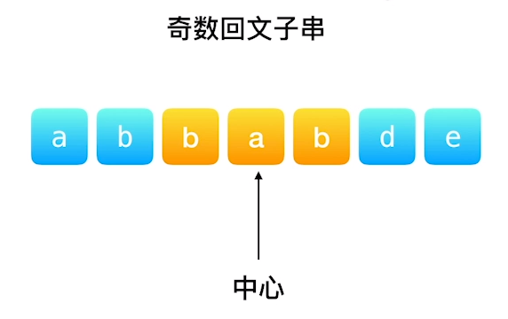
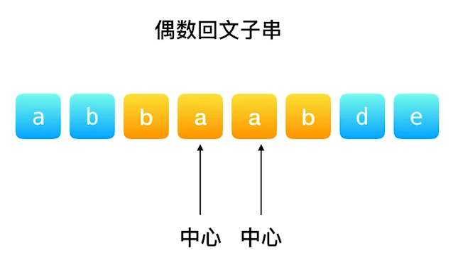
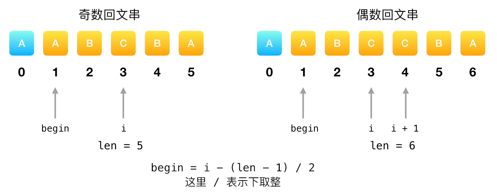

# 05.最长回文子串

## [题目描述](https://leetcode-cn.com/problems/longest-palindromic-substring/)

::: tip
标签: 字符串、动态规划
:::

给你一个字符串`s`，找到`s`中最长的回文子串。

示例 1:
```
  输入：s = "babad"
  输出："bab"
  解释："aba" 同样是符合题意的答案。
```

示例 2：
```
  输入：s = "cbbd"
  输出："bb"
```

示例 3：
```
  输入：s = "a"
  输出："a"
```

示例 4：
```
  输入：s = "ac"
  输出："a"
```

## 算法思路

中心扩散法

主要思路是 **枚举** 所有可能的回文子串的中心位置，在枚举的时候需要考虑回文子串的奇偶性，对于奇数回文子串来说，中心位置是一个字符，对于偶数来说，中心位置是两个相邻的字符。

需要注意的是，在枚举的过程中需要记录最长回文子串的相关变量。





```js
/**
 * @param {string} s
 * @return {string}
 */
var longestPalindrome = function (s) {
  // 首先处理边界条件
  if (s === null || s === undefined) {
    return
  }
  if (s.length < 2) {
    return s
  }
  // 记录最大的长度
  let maxlen = 0;
  let begin = 0;
  let len = s.length;

  // 遍历字符串,分别以奇数和偶数的维度来寻找回文子串
  for (let i = 0; i < len; i++) {
    // 借助函数拿到以奇数和偶数分别为中心的长度
    let oddmaxlen = helper(s, i, i);
    let evenmaxlen = helper(s, i, i + 1);
    let currentlen = Math.max(oddmaxlen, evenmaxlen);

    // 更新最大长度
    if (currentlen > maxlen) {
      maxlen = currentlen
      begin = i - Math.floor((maxlen - 1) / 2)
    }
  }
  return s.substring(begin, begin + maxlen)
};
/**
判判断是否是回文串的辅助函数
接收三个参数 字符串本身，中心点
*/
function helper(s, left, right) {
  // 当left = right 的时候，回文中心是一个字符，回文串的长度是奇数
  // 当right = left + 1 的时候，此时，回文中心是两个字符，回文串的长度是偶数
  while (left >= 0 && right < s.length) {
    // 左边界向左，右边界向右，逐个比对，直到不相同为止。
    if (s.charAt(left) === s.charAt(right)) {
      left--;
      right++;
    } else {
      break
    }
  }
  // 跳出循环的时候 恰好满足 s.charAt(left) !== s.charAt(right)
  // 回文串的长度是 right - left + 1 - 2 = right - left -1;
  // 5 6 7 8 9 总共几个数 9-5+1 = 5个数 去掉 5和 9 剩下 4个 一个道理
  return right - left - 1;
}
```

```ts
function longestPalindrome(s: string): string {
  if (s.length === 1) {
    return s
  }
  let maxlen = 0;
  let begin = 0;
  for (let i = 0; i < s.length; i++) {
    let oddmaxlen = helper(s, i, i);
    let evenmaxlen = helper(s, i, i + 1);
    let currentlen = Math.max(oddmaxlen, evenmaxlen);

    if (currentlen > maxlen) {
      maxlen = currentlen
      begin = i - Math.floor((maxlen - 1) / 2)
    }
  }
  return s.substring(begin, begin + maxlen)
};

function helper(s: string, left: number, right: number): number {
  while (left >= 0 && right < s.length) {
    if (s.charAt(left) === s.charAt(right)) {
      left--;
      right++;
    } else {
      break
    }
  }
  return right - left - 1;
}
```
稍微解释下上面的helper函数，在helper函数中，left和right分别代表当前回文子串的左右边界，它们的初始值是以当前字符为中心的回文子串的左右边界。然后，while循环中，left向左移动，right向右移动，直到left和right所在的字符不相等为止，此时left和right所在的位置刚好为不符合条件的场景。

因此，最终返回的是right-left-1，表示当前回文子串的长度。需要减去1的原因是，当left和right所在的位置不相等时，left和right已经分别移动了一位，所以需要减去1才能得到正确的回文子串长度。


这里面有一个细节，就是如何寻找起始位置


## 复杂度分析
- 时间复杂度：O(n^2)
- 空间复杂度：O(1)

**时间复杂度：**

* 函数 longestPalindrome 使用 for 循环遍历整个字符串 s，时间复杂度为 O(n)。
* 在循环内部，函数 helper 被调用两次，分别用于检查以 i 为中心奇数长度回文和以 i 和 i + 1 为中心偶数长度回文。
* 函数 helper 本身包含一个嵌套循环，该循环会一直迭代直到左右两侧字符不相等。
* 在最坏情况下，该循环会迭代整个字符串长度，因此函数 helper 的时间复杂度为 O(n)。
* 由于函数 helper 在循环内部被调用两次，且两者都具有 O(n) 的时间复杂度，因此整体时间复杂度为 O(n) * O(n) = O(n^2)。

**空间复杂度：**

* 代码使用常数空间来存储变量，例如 maxlen、begin、left 和 right。
* 函数 helper 除了参数和循环内部的临时变量外，不会使用任何额外的空间。
* 因此，整个代码的空间复杂度保持不变，为 O(1)。

**总结：**

提供的代码以 O(n^2) 的时间复杂度和 O(1) 的空间复杂度找到字符串中的最长回文。时间复杂度主要取决于用于检查回文字符的嵌套循环。对于较长的字符串，这种方法可能会变得计算成本高昂。

**改进建议：**

* 可以使用动态规划算法来提高代码效率，将时间复杂度降低到 O(n^2)。
* 动态规划算法会记录子问题的解决方案，并利用这些解决方案来避免重复计算。

**参考资料：**
* Longest Palindromic Substring: [https://leetcode.com/problems/longest-palindromic-substring/](https://leetcode.com/problems/longest-palindromic-substring/)


