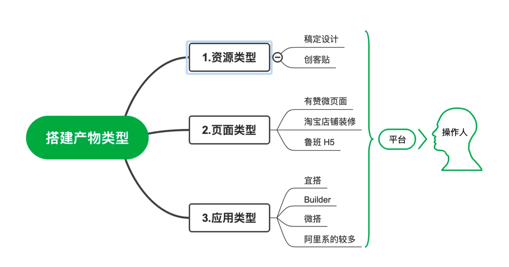
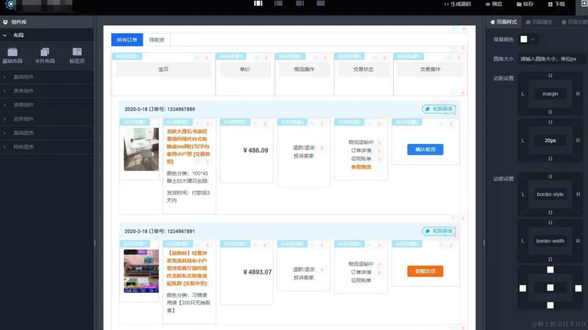
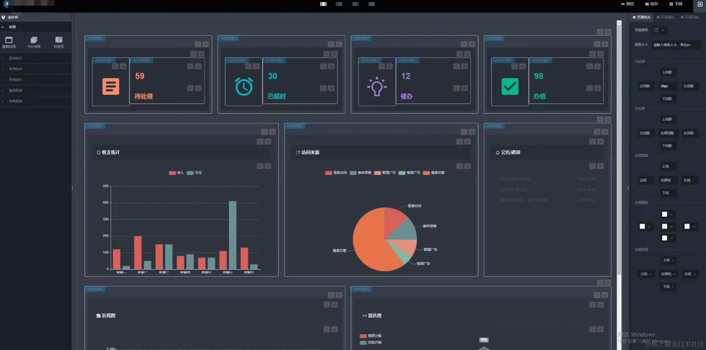
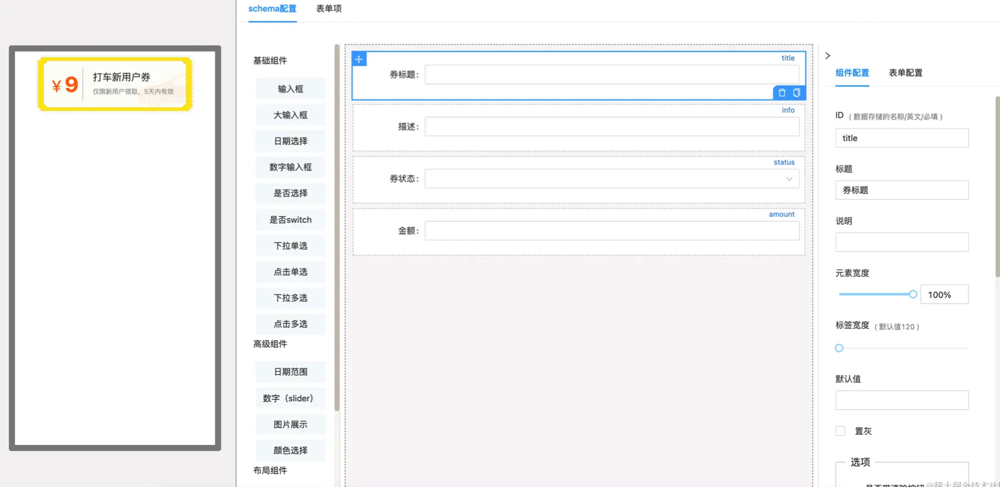
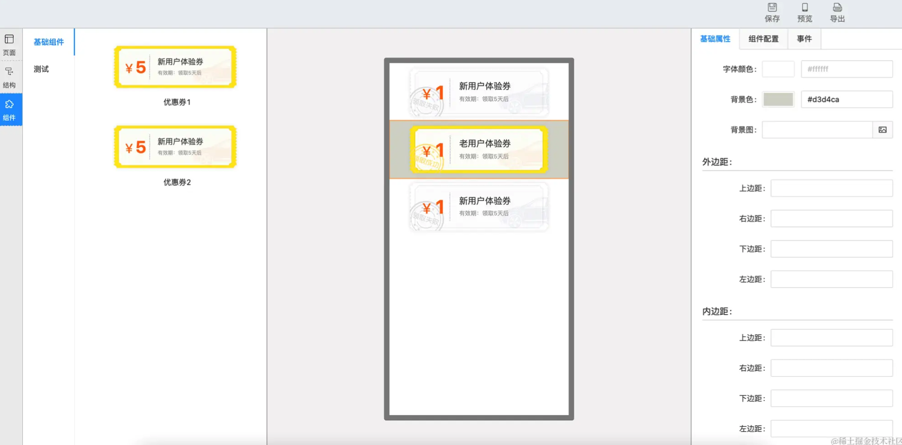

# 什么是低代码

可视化搭建顾名思义就是使用`GUI图形界面`，通过拖拽元素，设置属性，编排内容的方式，自己来 DIY 出需要专业人士编码才能产出的作品。

在早期 ADOBE 公司出品了一款网页设计的IDE, 名字叫做 Dreamweaver。相信很多同学都耳熟能详。除此之外就是 Android Studio 了。它们都具备图形界面完成布局和数据填充的能力。

类似的场景还有很多，大体上可以将其划分为三个大类型，分别是资源类型、页面类型、应用类型，具体的一些信息如下：

- **设计资源型**：通过一系列设置来形成理想中的资源文件，如活动海报、公众号首图等能够作用于其他地方的资源文件。大幅度提高了设计、运营的工作效率。比较典型的就是创客贴，稿定设计等平台；

- **页面类型**: 通过预置的物料组件来灵活的搭配出我们的网页页面，保存发布后可以被其他人预览。具有通用性和业务性。大多数公司都会有自己的内容搭建系统，这是目前用处相对比较广泛的一个类型，大部分电商公司的活动页面和宣导页面都是好的实践；

- **应用类型**: LowCode/NoCode 以编写少量代码甚至无需代码的情况下轻松的搭建一些应用或者是站点页面。与普通页面类型区别最大的点就是其拥有比较完善的工作流程和数据管理能力。拥有完善的版本控制与部署能力。

在两年前，我写过第一篇有关于低代码的文章《工程化之低代码体系》，并且也在直播跟多个场合都讨论过一些低代码相关的内容，过去两年中，在不断进行低代码相关业务的开发以及研究了一些业内其他的低代码产品之后，我又重新思考一遍低代码的价值、意义等。

下面将从我的视角与大家一起聊聊我个人对低代码的理解与思考，而我对于低代码的看法也是随着时间以及项目成熟度逐步进行了改变，从最开始到接触到现在，虽然大体的的方向虽然没变（降本提效），但是很多细节变化还是非常的多。

## 看山是山
在最开始接触 Low Code 的时候，主要是做可视化搭建相关的内容，这个时候的低代码想法非常的简单，我要做一款仅仅需要拖拽、配置就能完成整个项目搭建的产品，而不再需要开发大量的代码完成需求，减少无聊的重复工作与时间成本。

而在开发的过程中，我忽略了两个很重要的因素：
- 需求是无止境且多变的，作为技术不可能限制需求的类型；
- 不是所有的人都具备很高的逻辑思维与快速的学习能力；

为了应对不断的动态且不可预期的需求，我将所有的组件都设计成为了原子组件，理论上只要熟悉了配置模式与具备一定的审美能力，是可以通过这套系统搭建出绝大部分的业务场景。

但大量且复杂的配置项目让普通的产品以及无前端相关经验的同学没办法直接上手；

哪怕是前端同学也会有很高的使用成本，同时配置里面加入了大量的业务逻辑以及后端的模块，即使借助这个低代码系统可以整个工程的完成度与样式完成度都非常的高，但不可避免的问题是这套系统恐怕除了开发者之外的人都得培训很久才能熟练使用。

这个项目无疑是一个半失败的产品，在这个阶段我对于低代码的理解一直于 No Code 的阶段，但仅仅靠配置来完成业务需求，会导致配置项目非常复杂，且生成出来的代码是非常不友好的，每一次兼容新的需求都是对之前的系统代码非常大的挑战，因为源码里面包含了大量的兼容性逻辑。

我一直都站在了技术的角度去思考业务，做出来的产品并没有考虑到实际使用者的体验，直接拔高了用户的使用成本。

回过头想想，哪怕就是 Excel 这种高度成功的低代码产品，对于复杂需求也是提供了 VBS 的代码编排能力去解决问题而并没有将它全部可视化完成。

## 看山不是山
如果是单纯将 Low Code 理解为“显著减少编写代码所需工作量的编程解决方案”，那么所有的高级语言其实都是一种低代码的产物，因为它们使开发不必编写大量晦涩难懂的机器代码来编写应用程序，所有的高级语言都将人与机器之间拉了更近的一步，这也是为什么越是底层的语言会比更高级的语言更难学，因为机器与人的理解是不一样的。

拿我们常见的 React、Vue 来说，这种新的框架出现使得前端开发大量减少对底层 Dom 的操作，还有大量的脚手架、工具函数使得我们不再需要考虑开发工程的细枝末节，PostCSS 等样式处理的工具可以让开发不再去费神兼容各种浏览器样式，有 Babel 等这些之后，能让开发不用考虑语法的兼容性，所有的这一切都是为了使得开发专注于业务相关的 Coding，减少开发在重复的模块浪费时间。

虽然一些新手在直接学习这些高级框架的使用之后，也可能会降低原生 JS 的编程与理解能力。但是这个过程在我看来是很正常的，高级语言替代晦涩的低级语言本身就是时代的趋势，只有大量的减少研发成本，才能将降低产品的试错与提高交付效率，这样这个框架或者技术才能不断地进行良性迭代升级。

所以这个阶段我对低代码的理解是降低开发的学习成本、产品的研发成本为主要目标，并不是以是否写大量的代码来进行判断，这也是之前有段时间我感觉可以将 Low Code 改名为 Less Code 的原因。

基于这个理解以及在经历第一次失败的经验之后，我对低代码的产品形态也有其他的思考，绝不再追求 No Code 的模式，坚持 Less Code 的模式去混合编译完成产品，在这阶段中，我将低代码产品抽成了两种模型：

- 第一阶段：直面开发的复杂交互形态

此形态强耦合业务逻辑以及与后端接口交互，开发复杂或者全新的业务需求时采用 Pro Code 新增业务组件模式，此模式是为了在开发阶段最大可能提供功能完成闭环的物料模块，配套提供各种规范、工具、插件等让开发同学快速提供适配业务的物料。

- 第二阶段：面向运营、产品等无技术背景的同学的简单交互形态

所有的可视化搭建组件模型都完成业务自闭环，所以对于无技术背景的同学，可以做到只提供简单布局、样式等配置功能，无需对业务的后端逻辑承担配置成本，可以更关注于样式、数据埋点等营销相关内容，减少心智负担。

## 看山还是山

## 写在最后