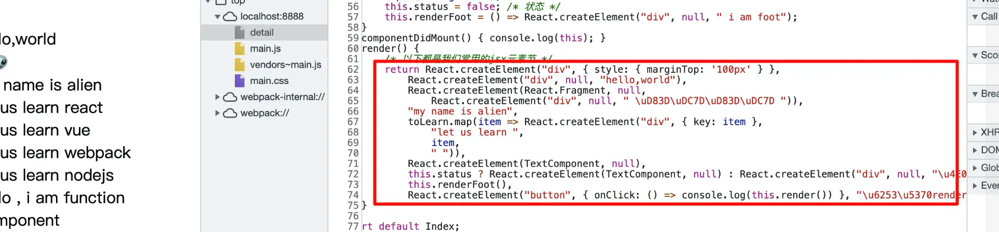
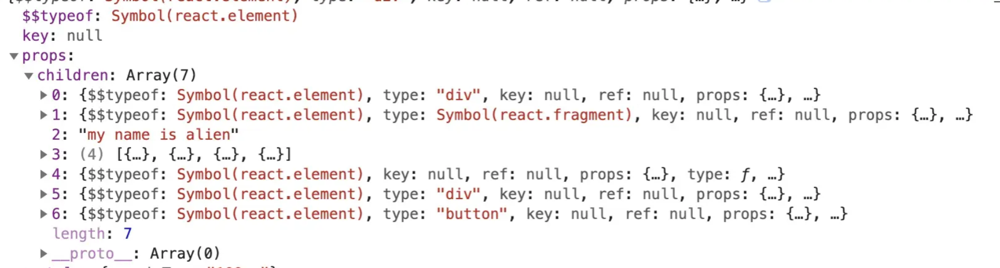
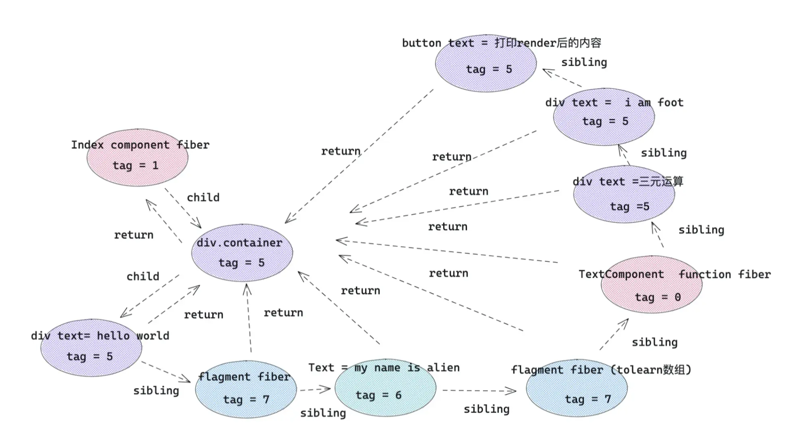

# 认识jsx

## 一 我们写的 JSX 终将变成什么

万物始于`jsx`，想要深入学习react ，就应该从`jsx`入手。弄清楚`jsx`，方便学习掌握以下内容：

- 了解常用的元素会被 React 处理成什么，有利于后续理解 react fiber 类型；
- 理解 jsx 的编译过程，方便操纵 children、控制 React 渲染，有利于便捷使用 React 插槽组件。

我写了一段 react JSX 代码，接下来，我们一步步看看它最后会变成什么样子。

```jsx
import React from 'react';

const toLearn = ['react', 'vue', 'webpack', 'nodejs']

const TextComponent = () => <div> hello , i am function component </div>

class Index extends React.Component {
  status = false /* 状态 */
  renderFoot = () => <div> i am foot</div>
  render() {
    /* 以下都是常用的jsx元素节 */
    return <div style={{ marginTop: '100px' }}   >
      { /* element 元素类型 */}
      <div>hello,world</div>
      { /* fragment 类型 */}
      <React.Fragment>
        <div> 👽👽 </div>
      </React.Fragment>
      { /* text 文本类型 */}
      my name is alien
      { /* 数组节点类型 */}
      {toLearn.map(item => <div key={item} >let us learn {item} </div>)}
      { /* 组件类型 */}
      <TextComponent />
      { /* 三元运算 */}
      {this.status ? <TextComponent /> : <div>三元运算</div>}
      { /* 函数执行 */}
      {this.renderFoot()}
      <button onClick={() => console.log(this.render())} >打印render后的内容</button>
    </div>
  }
}
```


### 1、babel 处理后的样子

首先我们看一下上述例子中的jsx模板会被babel编译成什么？



和上面看到的一样，上面写的JSX元素节点会被编译成 React Element 形式，那么，我们首先看一下 `React.createElement`的用法。

```js
React.createElement(
  type,
  [props],
  [...children]
)
```
`createElement`参数：
- 第一个参数：如果是组件类型，会传入组件对应的类或函数；如果是 dom 元素类型，传入 div 或者 span 之类的字符串。
- 第二个参数：一个对象，在 dom 类型中为标签属性，在组件类型中为 props 。
- 其他参数：依次为 children，根据顺序排列。

举个例子：

```jsx
<div>
   <TextComponent />
   <div>hello,world</div>
   let us learn React!
</div>
```

上面的代码会被 babel 先编译成：
```js
React.createElement("div", null,
    React.createElement(TextComponent, null),
    React.createElement("div", null, "hello,world"),
    "let us learn React!"
)
```

一些常见问题和解答：
问：老版本的 React 中，为什么写 jsx 的文件要默认引入 React?
如下：

```jsx
import React from 'react'
function Index(){
    return <div>hello,world</div>
}
```
答：因为 jsx 在被 babel 编译后，写的 jsx 会变成上述 React.createElement 形式，所以需要引入 React，防止找不到 React 引起报错。

### 2、createElement 处理后的样子

然后点击按钮，看一下写的 demo 会被 React.createElement 变成什么:



从上面写的 jsx 结构来看，外层的 div 被 react.createElement 转换成 react element 对象，div 里面的 8 个元素分别转换成 children 子元素列表。下面就是 jsx 的转换规则，请一定要记住，以便后续能更流畅地使用 jsx 语法。

|jsx元素类型|	react.createElement 转换后 |	type 属性 |
|----------|---------------------------|------|
|element元素类型	|react element类型 |	标签字符串，例如 div|
|fragment类型	    |react element类型 |symbol react.fragment类型
|文本类型	        |直接字符串	|无
|数组类型	         |返回数组结构，里面元素被react.createElement转换|	无
|组件类型	         |react element类型	|组件类或者组件函数本身
|三元运算 / 表达式	 |先执行三元运算，然后按照上述规则处理	|看三元运算返回结果
|函数执行	          |先执行函数，然后按照上述规则处理	|看函数执行返回结果


### 3、React 底层调和处理后，将变成什么？

最终，在调和阶段，上述 React element 对象的每一个子节点都会形成一个与之对应的 fiber 对象，然后通过 sibling、return、child 将每一个 fiber 对象联系起来。


所以，我们有必要先来看一下 React 常用的 fiber 类型，以及 element 对象和 fiber 类型的对应关系。

不同种类的 fiber Tag

React 针对不同 React element 对象会产生不同 tag (种类) 的fiber 对象。首先，来看一下 tag 与 element 的对应关系：

```js
export const FunctionComponent = 0;       // 函数组件
export const ClassComponent = 1;          // 类组件
export const IndeterminateComponent = 2;  // 初始化的时候不知道是函数组件还是类组件 
export const HostRoot = 3;                // Root Fiber 可以理解为根元素 ， 通过reactDom.render()产生的根元素
export const HostPortal = 4;              // 对应  ReactDOM.createPortal 产生的 Portal 
export const HostComponent = 5;           // dom 元素 比如 <div>
export const HostText = 6;                // 文本节点
export const Fragment = 7;                // 对应 <React.Fragment> 
export const Mode = 8;                    // 对应 <React.StrictMode>   
export const ContextConsumer = 9;         // 对应 <Context.Consumer>
export const ContextProvider = 10;        // 对应 <Context.Provider>
export const ForwardRef = 11;             // 对应 React.ForwardRef
export const Profiler = 12;               // 对应 <Profiler/ >
export const SuspenseComponent = 13;      // 对应 <Suspense>
export const MemoComponent = 14;          // 对应 React.memo 返回的组件

```

**jsx 最终形成的 fiber 结构图**
最终写的 jsx 会变成如下格式：




fiber 对应关系
- child：一个由父级 fiber 指向子级 fiber 的指针
- return：一个子级 fiber 指向父级 fiber 的指针
- sibling：一个 fiber 指向下一个兄弟 fiber 的指针

> 提示：
> - 对于上述在 jsx 中写的 map 数组结构的子节点，外层会被加上 fragment ；
> - map 返回数组结构，作为 fragment 的子节点。

## 进阶实践-可控性 render


