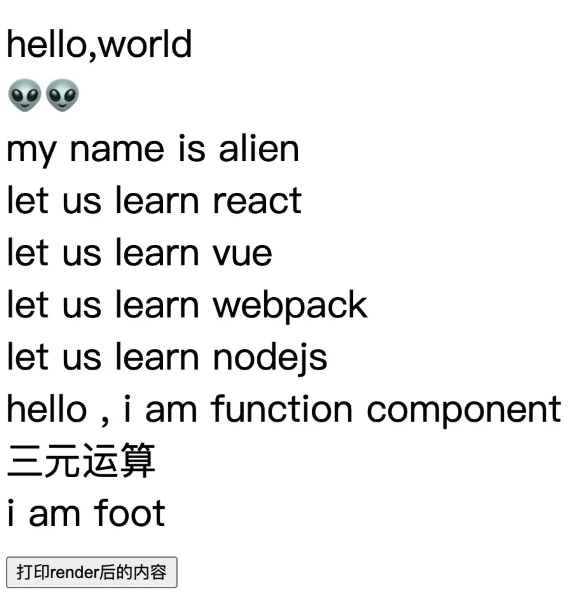

# 认识jsx

## 一 我们写的 JSX 终将变成什么

万物始于`jsx`，想要深入学习react ，就应该从`jsx`入手。弄清楚`jsx`，方便学习掌握以下内容：

- 了解常用的元素会被 React 处理成什么，有利于后续理解 react fiber 类型；
- 理解 jsx 的编译过程，方便操纵 children、控制 React 渲染，有利于便捷使用 React 插槽组件。

我写了一段 react JSX 代码，接下来，我们一步步看看它最后会变成什么样子。

```jsx
import React from 'react';

const toLearn = ['react', 'vue', 'webpack', 'nodejs']

const TextComponent = () => <div> hello , i am function component </div>

class Index extends React.Component {
  status = false /* 状态 */
  renderFoot = () => <div> i am foot</div>
  render() {
    /* 以下都是常用的jsx元素节 */
    return <div style={{ marginTop: '100px' }}   >
      { /* element 元素类型 */}
      <div>hello,world</div>
      { /* fragment 类型 */}
      <React.Fragment>
        <div> 👽👽 </div>
      </React.Fragment>
      { /* text 文本类型 */}
      my name is alien
      { /* 数组节点类型 */}
      {toLearn.map(item => <div key={item} >let us learn {item} </div>)}
      { /* 组件类型 */}
      <TextComponent />
      { /* 三元运算 */}
      {this.status ? <TextComponent /> : <div>三元运算</div>}
      { /* 函数执行 */}
      {this.renderFoot()}
      <button onClick={() => console.log(this.render())} >打印render后的内容</button>
    </div>
  }
}
```



### 1、babel 处理后的样子

首先我们看一下上述例子中的jsx模板会被babel编译成什么？


和上面看到的一样，上面写的JSX元素节点会被编译成 React Element 形式，那么，我们首先看一下 `React.createElement`的用法。

```js
React.createElement(
  type,
  [props],
  [...children]
)
```
`createElement`参数：
- 第一个参数：如果是组件类型，会传入组件对应的类或函数；如果是 dom 元素类型，传入 div 或者 span 之类的字符串。
- 第二个参数：一个对象，在 dom 类型中为标签属性，在组件类型中为 props 。
- 其他参数：依次为 children，根据顺序排列。

举个例子：

```jsx
<div>
   <TextComponent />
   <div>hello,world</div>
   let us learn React!
</div>
```

上面的代码会被 babel 先编译成：
```js
React.createElement("div", null,
    React.createElement(TextComponent, null),
    React.createElement("div", null, "hello,world"),
    "let us learn React!"
)
```


