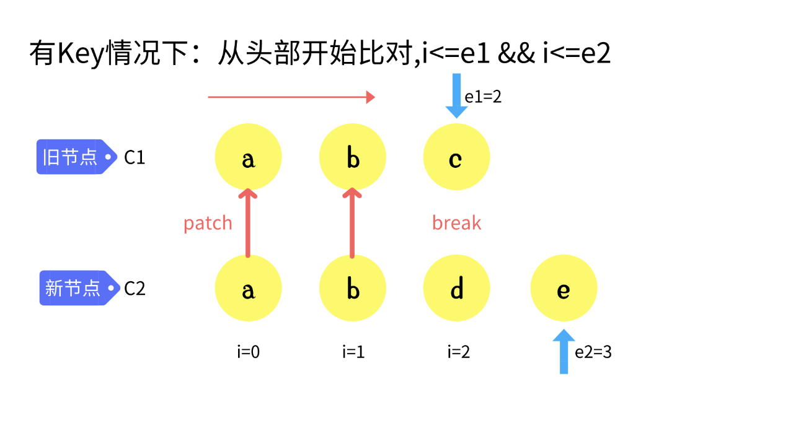
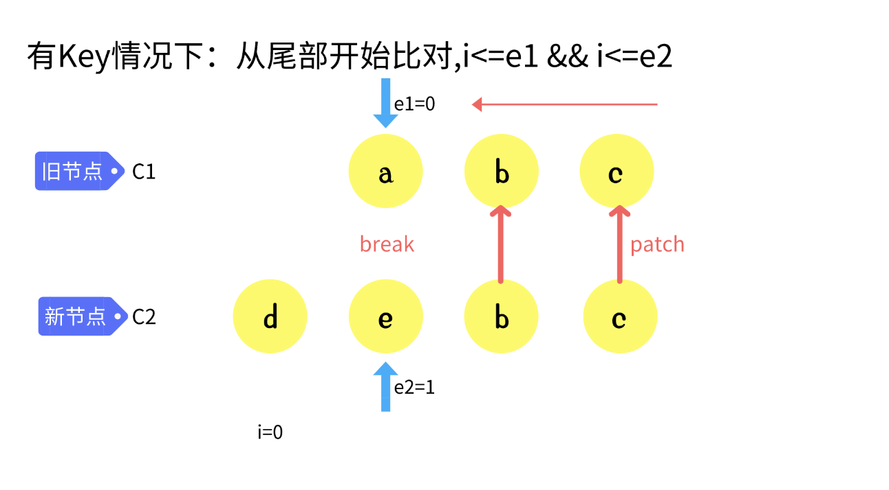
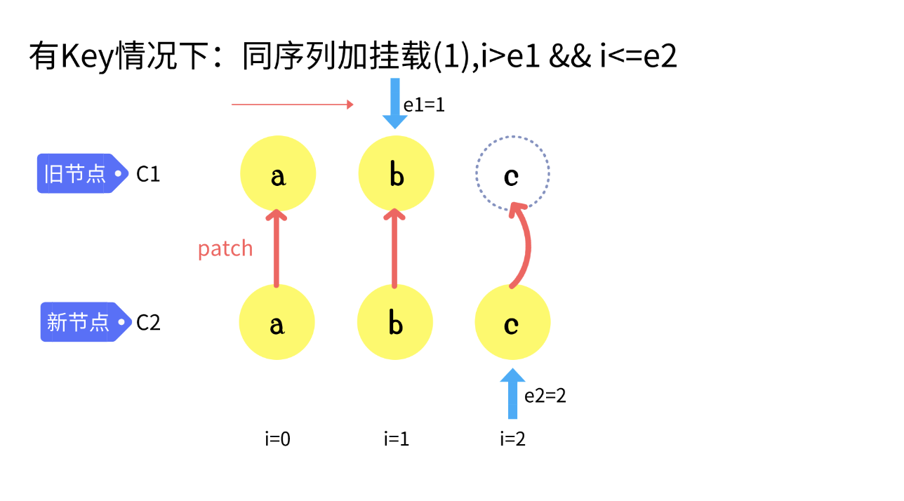
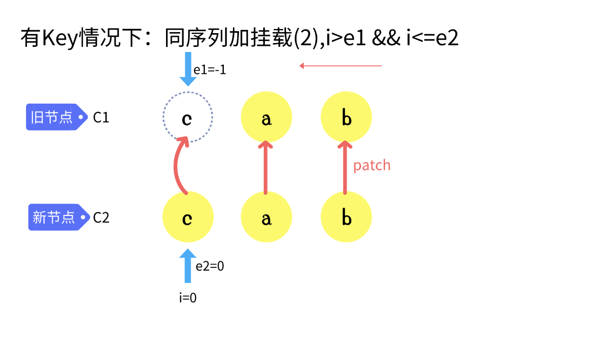
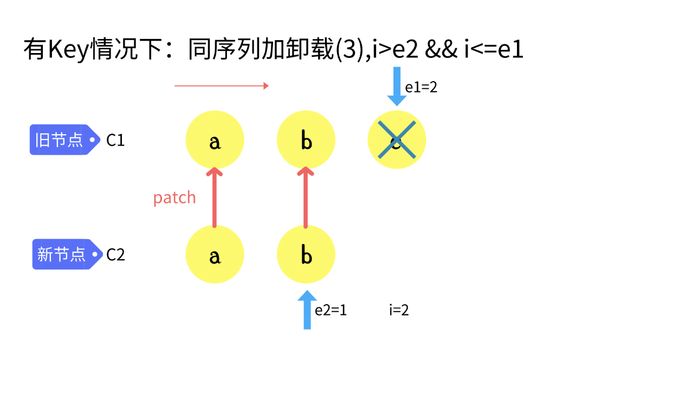
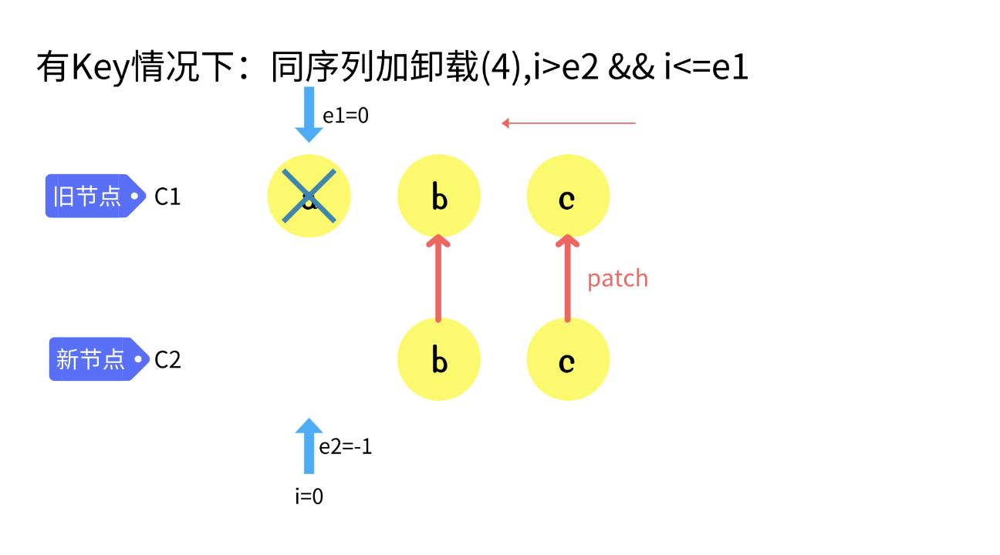
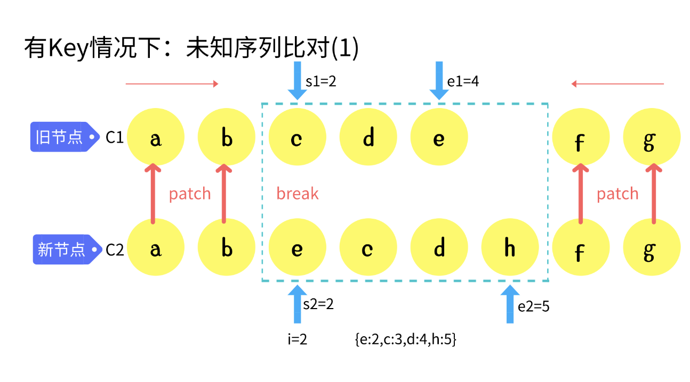
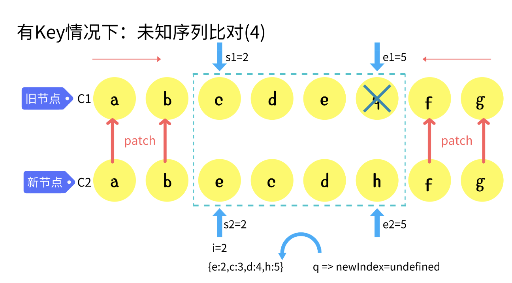
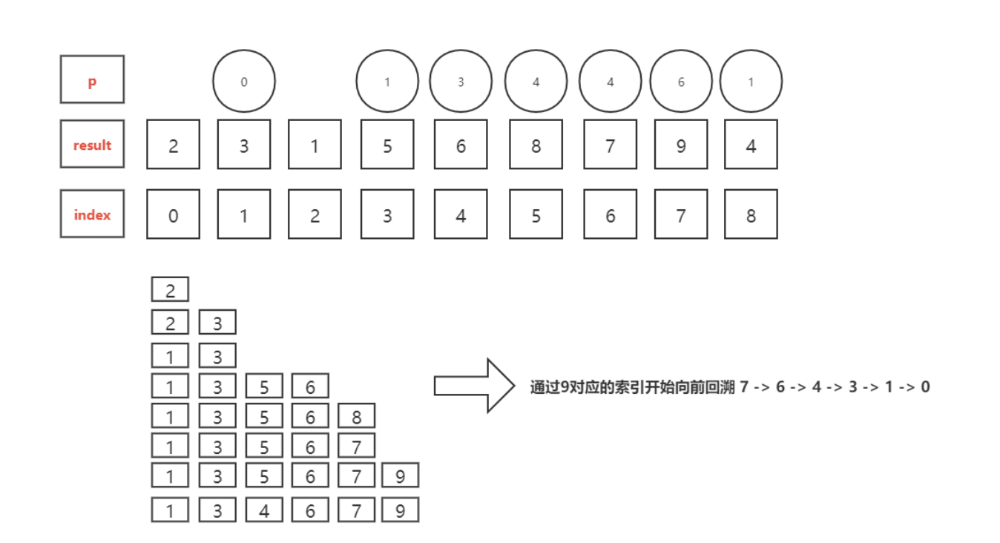

# Diff核心流程和原理

## 前后元素不一致

两个不同的虚拟节点不需要进行比较，直接移除老的节点，将新的虚拟节点渲染成真实的DOM进行挂载即可。

```js
// 判断两个虚拟节点的类型是不是一样
export const isSameVNodeType = (n1, n2) => {
  return n1.type === n2.type && n1.key === n2.key;
}

const patch = (n1,n2,container) => {
  // 初始化和diff算法都在这里喲
  if(n1 == n2){ return }
  if(n1 && !isSameVNodeType(n1,n2)){ // 有n1是n1和n2不是同一个节点
    unmount(n1)
    n1 = null
  }
  if (n1 == null) { // 初始化的情况
    mountElement(n2, container); 
  } else {
    // diff算法
  }
}
```
从上面的实现细节可以看出，如果两个虚拟节点相同，则不需要进行比对，直接返回即可，如果前后两个虚拟节点类型都不一样，根本无需比对，直接卸载掉上一个节点，将上一个节点重置为null,直接渲染新的节点即可。初始化的场景中，上一个节点确实为null，直接渲染即可。

所以diff的重点实际上是在元素节点是相同的，但是上面的属性不同，或者它的孩子发生了变化。

## 前后元素一致

前后元素一致则比较两个元素的属性和孩子节点，这个上面我们已经分析了出来。

```js
const patchElement = (n1, n2) => {
  let el = (n2.el = n1.el);
  const oldProps = n1.props || {};
  const newProps = n2.props || {};
  patchProps(oldProps, newProps, el); // 比对新老属性
  patchChildren(n1, n2, el); // 比较元素的孩子节点
}

const processElement = (n1, n2, container) => {
  if (n1 == null) {
    mountElement(n2, container)
  } else {
    patchElement(n1, n2); // 比较两个元素
  }
}
```

总结下来，差异的场景主要有八种:

| 新节点儿子 | 旧节点儿子| 操作方式 |
|-----------|-----------| -------|
|文本	|数组	|（删除老儿子，设置文本内容）|
|文本	|文本	|（更新文本即可）|
|文本	|空	|（更新文本即可) 与上面的类似|
|数组	|数组|	（diff算法）|
|数组	|文本|	（清空文本，进行挂载）|
|数组	|空	|（进行挂载） 与上面的类似|
|空	  |数组	|（删除所有儿子）|
|空	  |文本	|（清空文本）|
|空	  |空	|（无需处理）|

```js
const unmountChildren = (children) => {
  for(let i = 0 ; i < children.length; i++) {
    unmount(children[i]);
  }
}

const patchChildren = (n1,n2,el) => {
  const c1 = n1 && n1.children
  const c2 = n2.children
  const prevShapeFlag = n1.shapeFlag;
  const shapeFlag = n2.shapeFlag;
  
  // 当前的是文本，老的可能是 文本、空、数组
  if (shapeFlag & ShapeFlags.TEXT_CHILDREN) {
    if (prevShapeFlag & ShapeFlags.ARRAY_CHILDREN) { // 老的是数组，直接移除老的节点
      unmountChildren(c1);
    }
    // 当前的是文本，老的可能是 文本、空
    // 只需要判断前后是否一致，不一致直接用新的覆盖
    if (c1 !== c2){ 
      hostSetElementText(el,c2);
    }
  } else {
    // 老的是数组
    if (prevShapeFlag & ShapeFlags.ARRAY_CHILDREN) {
      if (shapeFlag & ShapeFlags.ARRAY_CHILDREN) { // 新的是数组
      // TODO 核心diff算法
      } else {
        // 新的是空，直接将老的移除就可以了
        unmountChildren(c1);
      }
    } else {
      // 老的是文本 新的是空
      if (prevShapeFlag & ShapeFlags.TEXT_CHILDREN) {
        hostSetElementText(el,'');
      }
      // 老的为空 新的是数组
      if (shapeFlag & ShapeFlags.ARRAY_CHILDREN) {
        mountChildren(c2, el);
      }
    }
  }
}
```

从上面的代码实现细节可以看出，会将两个虚拟节点的类型拿出来比较，以新的节点作为基准，上面列的表格中已经显示出来总共需要处理9种场景：
- 在新的节点是文本的条件下：
  - 如果老的节点孩子是数组，则将老的节点孩子直接卸载移除就可以了。
  - 如果老的节点孩子是文本或者空，直接判断是否相同，不相同直接覆盖就好。

- 新的节点是数组或者空的条件下：
  - 老的节点孩子是数组的条件下：
    - 新的节点的孩子也是数组的条件下：
      - 需要核心的diff的比较
    - 新的节点孩子不是数组
      - 直接卸载老的孩子节点
  - 老的孩子节点不是数组
    - 老的孩子节点是文本类型
      - 设置节点元素为空
    - 新的节点孩子类型为数组
      - 直接设置新的孩子节点

## 核心Diff算法


### 场景一：自前向后的diff比对。

**sync from start**



```js
// 之前的节点
h('div',[
  h('li', { key: 'a' }, 'a'),
  h('li', { key: 'b' }, 'b'),
  h('li', { key: 'c' }, 'c')
]) 


// 更新后节点
h('div',[
  h('li', { key: 'a' }, 'a'),
  h('li', { key: 'b' }, 'b'),
  h('li', { key: 'd' }, 'd'),
  h('li', { key: 'e' }, 'e')
])
```

从上面的这个用例可以看出，更新后的节点开头的前两个元素无论是key还是元素的type都是一样的，不同的地方在后面。所以这种场景就是使用自前向后比对。

```js
const patchKeydChildren = (c1, c2, container) => {
  let i = 0;
  const l2 = c2.length;
  let e1 = c1.length - 1;
  let e2 = l2 - 1;
  // 1. sync from start
  // (a b) c
  // (a b) d e
  while (i <= e1 && i <= e2) {
    const n1 = c1[i];
    const n2 = c2[i];
    
    if (isSameVNodeType(n1, n2)) {
      // 对比差异，进行打补丁
      patch(n1, n2, container)
    } else {
      // 不是同一个节点直接跳出循环，使用其他的策略
      break;
    }

    i++;
  }
}
```

### 场景二：自后向前的diff比对。

**sync from end**



```js
// 2. sync from end
// a (b c)
// d e (b c)
while (i <= e1 && i <= e2) {
  const n1 = c1[e1];
  const n2 = c2[e2];
  if (isSameVNodeType(n1, n2)) {
    patch(n1, n2, container);
  } else {
    break;
  }
  e1--;
  e2--;
}
```

### 场景三：新的节点比旧的节点元素多

**common sequence + mount**





```js
// 3. common sequence + mount
// (a b)
// (a b) c
// i = 2, e1 = 1, e2 = 2
// (a b)
// c (a b)
// i = 0, e1 = -1, e2 = 0
if (i > e1) { // 说明有新增 
  if (i <= e2) { // 表示有新增的部分
    // 先根据e2 取他的下一个元素  和 数组长度进行比较
    const nextPos = e2 + 1;
    const anchor = nextPos < c2.length ? c2[nextPos].el : null;
    while (i <= e2) {
      patch(null, c2[i], container, anchor);
      i++;
    }
  }
}
```
从上面的图片可以看出，主要是找到插入的锚点，实际对应的是两种场景，在最后面插入，还是在最前面插入。


### 场景四：旧的节点比新的节点元素多

**common sequence + unmount**






```js
// 4. common sequence + unmount
// (a b) c
// (a b)
// i = 2, e1 = 2, e2 = 1
// a (b c)
// (b c)
// i = 0, e1 = 0, e2 = -1
else if (i > e2) {
  while (i <= e1) {
    unmount(c1[i])
    i++
  }
}
```

### 场景五：乱序比对:

unknown sequence

上面展示的一些场景都是比较基础的场景，在真实的业务中场景会相对复杂。比如一些乱序的场景：



第一步就是基于新的孩子创建一个map映射。

```js
// 5. unknown sequence
// a b [c d e] f g
// a b [e c d h] f g
// i = 2, e1 = 4, e2 = 5

const s1 = i;
const s2 = i;
const keyToNewIndexMap = new Map();

for (let i = s2; i <= e2; i++) {
  const nextChild = c2[i];
  keyToNewIndexMap.set(nextChild.key, i);
}
```

loop through old children left to be patched and try to patch

```js
const toBePatched = e2 - s2 + 1;
const newIndexToOldMapIndex = new Array(toBePatched).fill(0);

for (let i = s1; i <= e1; i++) {
  const prevChild = c1[i];
  let newIndex = keyToNewIndexMap.get(prevChild.key); // 获取新的索引
  if (newIndex == undefined) {
    unmount(prevChild); // 老的有 新的没有直接删除
  } else {
    newIndexToOldMapIndex[newIndex - s2] = i + 1;
    patch(prevChild, c2[newIndex], container);
  }
}
```



```js
for (let i = toBePatched - 1; i >= 0; i--) {
  const nextIndex = s2 + i; // [ecdh]   找到h的索引 
  const nextChild = c2[nextIndex]; // 找到 h
  let anchor = nextIndex + 1 < c2.length ? c2[nextIndex + 1].el : null; // 找到当前元素的下一个元素
  
  if (newIndexToOldMapIndex[i] == 0) { // 这是一个新元素 直接创建插入到 当前元素的下一个即可
    patch(null, nextChild, container, anchor)
  } else {
    // 根据参照物 将节点直接移动过去  所有节点都要移动 （但是有些节点可以不动）
    hostInsert(nextChild.el, container, anchor);
  }
}
```

## 最长递增子序列：

最长递增子序列可以分为两个步骤，先按照**贪心**和**二分**求出最长递增序列的个数，

当前元素会记住它前面的元素的索引，然后倒序回溯。




```js
function getSequence(arr) { // 最终的结果是索引 
    const len = arr.length;
    const result = [0]; // 索引  递增的序列 用二分查找性能高
    const p = arr.slice(0); // 里面内容无所谓 和 原本的数组相同 用来存放索引
    let start;
    let end;
    let middle;
    for (let i = 0; i < len; i++) { // O(n)
        const arrI = arr[i];
        if (arrI !== 0) {
            let resultLastIndex = result[result.length - 1];
            // 取到索引对应的值
            if (arr[resultLastIndex] < arrI) {
              p[i] = resultLastIndex; // 标记当前前一个对应的索引
              result.push(i);
              // 当前的值 比上一个大 ，直接push ，并且让这个人得记录他的前一个
              continue
            }
            // 二分查找 找到比当前值大的那一个
            start = 0;
            end = result.length - 1;
            while (start < end) { // 重合就说明找到了 对应的值  // O(logn)
              middle = ((start + end) / 2) | 0; // 找到中间位置的前一个
              if (arr[result[middle]] < arrI) {
                start = middle + 1
              } else {
                end = middle
              } // 找到结果集中，比当前这一项大的数
            }
            // start / end 就是找到的位置
            if (arrI < arr[result[start]]) { // 如果相同 或者 比当前的还大就不换了
                if (start > 0) { // 才需要替换
                    p[i] = result[start - 1]; // 要将他替换的前一个记住
                }
                result[start] = i;
            }
        }
    }
    let i = result.length // 总长度
    let last = result[i - 1] // 找到了最后一项
    while (i-- > 0) { // 根据前驱节点一个个向前查找
        result[i] = last // 最后一项肯定是正确的
        last = p[last]
    }
    return result;
}
console.log(getSequence([2, 3, 1, 5, 6, 8, 7, 9, 4]))
```


